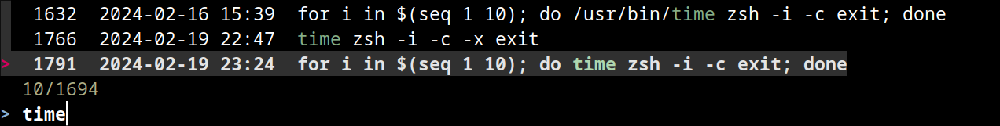
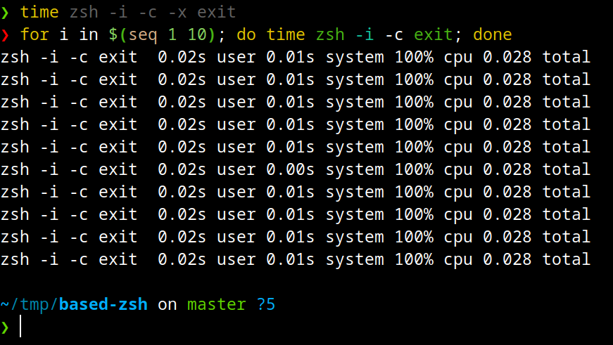
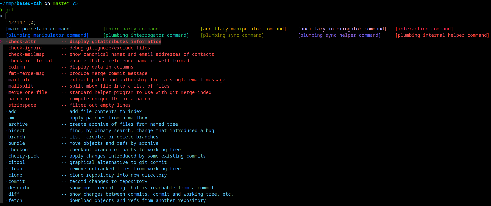

# Based ZSH

## Note: on first run it will download a lot of shit. It will never happen again after this.

# Install
```zsh
echo 'ZDOTDIR=${XDG_CONFIG_HOME:-~/.config}/zsh' | sudo tee /etc/zsh/zshenv
echo 'ZDOTDIR=${XDG_CONFIG_HOME:-~/.config}/zsh' | sudo tee /etc/zshenv
# OR
# echo 'ZDOTDIR=${XDG_CONFIG_HOME:-~/.config}/zsh' > .zshenv
ZSH_CONFIG=~/.config/zsh
mkdir -p $ZSH_CONFIG
git clone --depth=1 --single-branch https://github.com/clydebottoms/based-zsh $ZSH_CONFIG
# OR
# curl -o $ZSH_CONFIG/.zshrc https://raw.githubusercontent.com/clydebottoms/based-zsh/main/.zshrc
# wget -O $ZSH_CONFIG/.zshrc https://raw.githubusercontent.com/clydebottoms/based-zsh/main/.zshrc
```

# Uninstall
```zsh
sudo rm /etc/zsh/zshenv
```





# Plugins
- ajeetdsouza/zoxide
- joshskidmore/zsh-fzf-history-search
- romkatv/powerlevel10k
- Aloxaf/fzf-tab
- zdharma-continuum/fast-syntax-highlighting
- zsh-users/zsh-autosuggestions
- jeffreytse/zsh-vi-mode

# Custom commands

fuckoff
```zsh
fo() {
	for annoyances in $(pgrep -f "$@")
	do
		kill -9 "$annoyances"
	done
}
```

fastclone
```zsh
alias clone=git clone --depth=1 --single-branch
```

Are you tired of every kill command being useless and not killing the fucking program? This is for you. Be careful not to accidentally kill your init or systemd or whatever with this by matching it on accident.